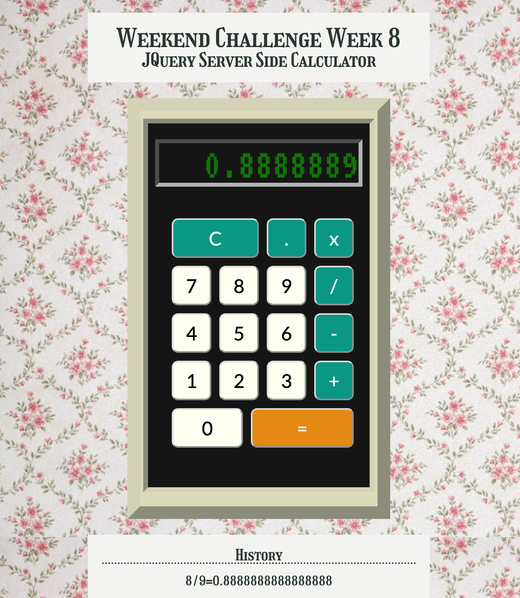

# JQuery Server Side Calculator

## A calculator interface with logic happening on the server

_Weekend Challenge_

This is a calculator app which uses jQuery to pull inputs from the DOM and display answers, server-side logic to do basic calculations from user inputs, and ajax to communicate between client and server.

Similar to a simple handheld calculator, users can enter combinations of numbers and operators to perform calculations. If not all required inputs are given, user is alerted before calculation goes through. If the inputs are not numbers (such as an entry with two decimal places), calculator will display ('ERR'). If no first number is given, calculator will assume the last answer is the first number. A history of calculations is displayed on the DOM that persists through browser refreshes but clears when the server is restarted.

To see the fully functional site, please visit: [this deployment on heroku](https://haleyr-server-calculator.herokuapp.com/)

### Prerequisites/Dependencies

- [Node.js](https://nodejs.org/en/)
- express
- body-parser (included in express)

## Setup

In a terminal window or editor of choice:

Run npm init/npm install to get the dependencies.

Run npm start to run server, and view the app on localhost:5000

## Technologies Used

- jQuery
- JavaScript
- HTML
- CSS
- Node
- Express

## Acknowledgement
Thanks to [Prime Digital Academy](www.primeacademy.io) for the instruction and guidance to make this app.

